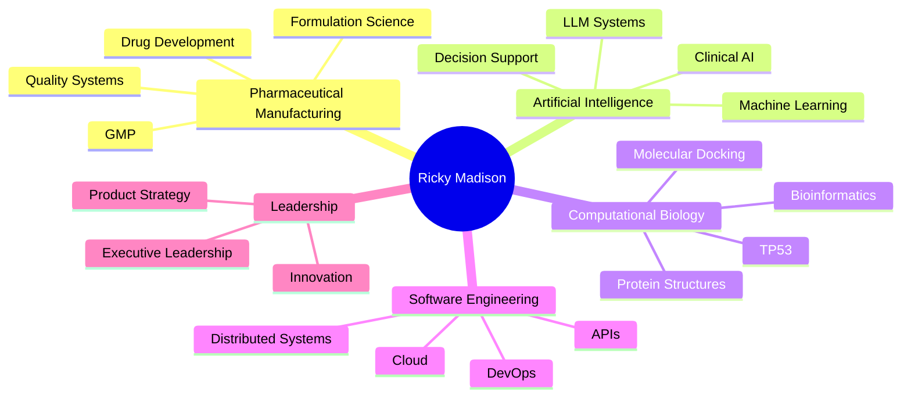

<!--
██████╗ ██╗ ██████╗██╗  ██╗██╗   ██╗    ███╗   ███╗ █████╗ ██████╗ ██╗███████╗ ██████╗ ███╗   ██╗
██╔══██╗██║██╔════╝██║ ██╔╝╚██╗ ██╔╝    ████╗ ████║██╔══██╗██╔══██╗██║██╔════╝██╔═══██╗████╗  ██║
██████╔╝██║██║     █████╔╝  ╚████╔╝     ██╔████╔██║███████║██║  ██║██║███████╗██║   ██║██╔██╗ ██║
██╔══██╗██║██║     ██╔═██╗   ╚██╔╝      ██║╚██╔╝██║██╔══██║██║  ██║██║╚════██║██║   ██║██║╚██╗██║
██║  ██║██║╚██████╗██║  ██╗   ██║       ██║ ╚═╝ ██║██║  ██║██████╔╝██║███████║╚██████╔╝██║ ╚████║
╚═╝  ╚═╝╚═╝ ╚═════╝╚═╝  ╚═╝   ╚═╝       ╚═╝     ╚═╝╚═╝  ╚═╝╚═════╝ ╚═╝╚══════╝ ╚═════╝ ╚═╝  ╚═══╝
-->

<div align="center">


# 🧬 Ricky Madison

### Pharmaceutical & Regulated AI Systems Executive

**Drug Development • Oncology AI • Computational Biology • Regulated Software • Technology Founder**

<p align="center">

<a href="https://linkedin.com/in/ricky-madison">

</a>

<a href="https://x.com/rickywmadison">

</a>

<a href="https://medium.com/@ricky-madison">

</a>

<a href="https://youtube.com/@ricky-madison">

</a>

<a href="https://researchgate.net/">

</a>

<a href="https://orcid.org/">

</a>

</p>


</div>

---

# ⚜ Executive Profile

> Operating at the intersection of **pharmaceutical manufacturing**, **computational oncology**, **regulated artificial intelligence**, and **scientific software engineering**.

For more than fifteen years I have designed technology platforms spanning pharmaceutical formulation, medical software, deterministic AI systems, molecular modelling, and institutional-grade scientific infrastructure.

My work focuses on translating complex biomedical research into production-ready software that meets the expectations of regulated environments.

---

# ⚡ Current Focus

```text
Drug Discovery               ████████████████████ 100%
Computational Oncology       ██████████████████░ 95%
Applied Artificial Intelligence██████████████████ 98%
Regulated Software           ███████████████████ 98%
Structural Bioinformatics    █████████████████░░ 90%
Pharmaceutical Manufacturing █████████████████░░ 92%
Cloud Infrastructure         ████████████████░░░ 85%
```

---

# 📊 Executive Dashboard

<div align="center">

| | |
|:---:|:---:|
|||
|||

</div>

---

# 🧭 Technical Radar

<div align="center">


</div>

---

# 🏛 Core Competencies

| Scientific | Engineering | Leadership |
|------------|-------------|------------|
| Oncology AI | Distributed Systems | Executive Strategy |
| Molecular Docking | Cloud Architecture | Product Vision |
| Computational Biology | DevOps | Scientific Leadership |
| Structural Biology | API Design | Regulatory Programs |
| Pharmaceutical Science | Full Stack Development | Technology Roadmaps |
| Precision Medicine | AI Infrastructure | Innovation Management |

---

# 🚀 Flagship Projects

## 🧬 HyperLab53

### Mutation-Aware p53 Discovery Platform

Institutional-grade computational workspace enabling researchers to progress from a TP53 mutation to evidence-linked therapeutic candidates within a unified deterministic workflow.

<table>

<tr>
<td width="50%">

### Capabilities

- Mutation-aware structural modelling
- Physics-based docking
- Simulated annealing
- Prime editing integration
- Rescue Brief generation
- COSMIC integration
- OpenTargets integration
- Evidence validation
- JSON reproducibility

</td>

<td width="50%">

| Metric | Value |
|------|------|
| TP53 Variants | 4,000+ |
| Prime Editing Coverage | 1,227 |
| PMID Validation | 100% |
| Live APIs | Multiple |
| Docking Engine | Deterministic |
| Architecture | Production Ready |

</td>

</tr>

</table>

---

## 📈 OncoMonitor

Patent Pending

AI-powered oncology monitoring platform combining deterministic ECG signal quality analysis with intelligent clinical decision support.

**Highlights**

- AI-assisted clinical monitoring
- Signal quality verification
- Explainable decision engine
- Regulatory-first architecture
- Clinical workflow integration

---

# 🛠 Technology Stack

## Languages

<p align="center">


</p>

---

## Languages & Expertise

| Language | Experience |
|----------|-----------|
| Python | ████████████████████ |
| TypeScript | ███████████████████ |
| JavaScript | ███████████████████ |
| C# | ██████████████████ |
| SQL | █████████████████ |
| R | ███████████████ |
| C++ | █████████████ |
| Java | ████████████ |

---

# ☁ Platform Expertise

```text
Artificial Intelligence
██████████████████████████████████

Machine Learning
████████████████████████████████

Drug Discovery
██████████████████████████████████

Bioinformatics
██████████████████████████████

Cloud Infrastructure
████████████████████████████

DevOps
███████████████████████████

System Architecture
████████████████████████████████

Regulatory Compliance
██████████████████████████████████
```

---

# 🏆 Professional Domains



---

# 📈 GitHub Activity

<div align="center">


</div>

---

# 🏅 Achievements

<div align="center">


</div>

---

# 🌍 Areas of Research

- Artificial Intelligence
- Computational Oncology
- Precision Medicine
- Structural Bioinformatics
- Pharmaceutical Manufacturing
- Drug Discovery
- Regulated Software
- Explainable AI
- Scientific Computing
- Molecular Modelling

---

# 📚 Currently

- 🧬 Building **HyperLab53**
- ⚕ Developing deterministic oncology AI
- 🧪 Advancing AI-driven pharmaceutical formulation
- 🎓 Professional Doctorate — University of Limerick
- 🚀 Building production scientific platforms

---

<div align="center">

### "Engineering scientific systems where reproducibility, regulation, and innovation converge."


</div>


<!--

Replace:

YOUR_USERNAME

with your GitHub username.

Recommended repositories:

github-readme-stats
github-readme-streak-stats
github-readme-activity-graph
github-profile-summary-cards
github-profile-trophy
readme-typing-svg
capsule-render
skillicons

-->
