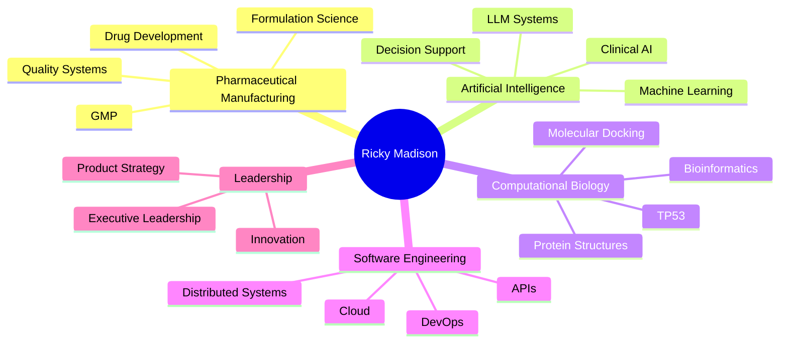

<!--
██████╗ ██╗ ██████╗██╗  ██╗██╗   ██╗    ███╗   ███╗ █████╗ ██████╗ ██╗███████╗ ██████╗ ███╗   ██╗
██╔══██╗██║██╔════╝██║ ██╔╝╚██╗ ██╔╝    ████╗ ████║██╔══██╗██╔══██╗██║██╔════╝██╔═══██╗████╗  ██║
██████╔╝██║██║     █████╔╝  ╚████╔╝     ██╔████╔██║███████║██║  ██║██║███████╗██║   ██║██╔██╗ ██║
██╔══██╗██║██║     ██╔═██╗   ╚██╔╝      ██║╚██╔╝██║██╔══██║██║  ██║██║╚════██║██║   ██║██║╚██╗██║
██║  ██║██║╚██████╗██║  ██╗   ██║       ██║ ╚═╝ ██║██║  ██║██████╔╝██║███████║╚██████╔╝██║ ╚████║
╚═╝  ╚═╝╚═╝ ╚═════╝╚═╝  ╚═╝   ╚═╝       ╚═╝     ╚═╝╚═╝  ╚═╝╚═════╝ ╚═╝╚══════╝ ╚═════╝ ╚═╝  ╚═══╝
-->

<div align="center">


# 🧬 Ricky Madison

### Pharmaceutical & Regulated AI Systems Executive

**Drug Development • Oncology AI • Computational Biology • Regulated Software**

<p>

<a href="https://linkedin.com/in/ricky-madison">

</a>

<a href="https://x.com/rickywmadison">

</a>

<a href="https://researchgate.net/">

</a>

<a href="https://orcid.org/">

</a>

</p>


</div>

---

# ⚜ Executive Profile

Operating at the intersection of **pharmaceutical manufacturing**, **computational oncology**, **regulated artificial intelligence**, and **scientific software engineering**.

For more than fifteen years I have designed scientific platforms spanning pharmaceutical formulation, molecular modelling, deterministic AI, computational biology, and institutional-grade software engineering.

---

# ⚡ Current Focus

```text
Drug Discovery                  ████████████████████ 100%
Computational Oncology          ███████████████████░ 96%
Artificial Intelligence         ████████████████████ 98%
Regulated Software              ████████████████████ 99%
Structural Bioinformatics       ██████████████████░░ 93%
Pharmaceutical Manufacturing    ██████████████████░░ 92%
Cloud Infrastructure            █████████████████░░░ 86%
```

---

# 📊 GitHub Dashboard

<div align="center">

<!-- GitHub Profile Summary -->

<br><br>

<!-- GitHub Streak -->


<br><br>

<!-- Languages -->


<br><br>

<!-- Profile Overview -->


</div>

---

# 🧭 Technical Profile

| Domain | Expertise |
|---------|:---------:|
| Artificial Intelligence | ████████████████████ 98% |
| Computational Oncology | ███████████████████░ 96% |
| Drug Discovery | ████████████████████ 99% |
| Structural Biology | ███████████████████░ 95% |
| Bioinformatics | ███████████████████░ 95% |
| Pharmaceutical Manufacturing | ██████████████████░ 94% |
| Software Architecture | ████████████████████ 98% |
| Cloud Engineering | █████████████████░░░ 86% |
| Regulatory Systems | ████████████████████ 99% |

---

# 🏛 Core Competencies

| Scientific Computing | Engineering | Executive Leadership |
|----------------------|------------|----------------------|
| Oncology AI | Distributed Systems | Technology Strategy |
| Molecular Docking | Cloud Architecture | Product Leadership |
| Computational Biology | API Design | Scientific Leadership |
| Protein Modelling | DevOps | Innovation Management |
| Precision Medicine | AI Infrastructure | Regulatory Strategy |
| Drug Discovery | Enterprise Software | Research Translation |

---

# 🚀 Flagship Projects

## 🧬 HyperLab53

## 🚀 Flagship Projects

<table style="width:100%">
<tr>

<td width="50%" valign="top">

<h3 align="center">🧬 HyperLab53</h3>

<p align="center">
<b>Mutation-Aware TP53 Discovery Platform</b>
</p>

<p>
A deterministic computational oncology platform designed to move from TP53 mutation analysis to evidence-linked therapeutic candidates within a reproducible scientific workflow.
</p>

<br>

<table style="width:100%">

<tr>
<th style="width:80%">Capability</th>
<th style="width:20%; text-align:center">Status</th>
</tr>

<tr>
<td>Structural modelling</td>
<td align="center">✅</td>
</tr>

<tr>
<td>Physics-based docking</td>
<td align="center">✅</td>
</tr>

<tr>
<td>Simulated annealing</td>
<td align="center">✅</td>
</tr>

<tr>
<td>Prime-editing integration</td>
<td align="center">✅</td>
</tr>

<tr>
<td>COSMIC integration</td>
<td align="center">✅</td>
</tr>

<tr>
<td>Open Targets integration</td>
<td align="center">✅</td>
</tr>

<tr>
<td>PMID evidence validation</td>
<td align="center">✅</td>
</tr>

<tr>
<td>JSON reproducibility</td>
<td align="center">✅</td>
</tr>

</table>

</td>


<td width="50%" valign="top">

<h3 align="center">📊 HyperLab53</h3>

<p align="center">
<b>Platform Performance Metrics</b>
</p>

<p>
A production-ready scientific platform architecture combining computational biology, deterministic AI, and evidence-driven therapeutic discovery.
</p>

<br>

<table style="width:100%">

<tr>
<th style="width:70%">Metric</th>
<th style="width:30%; text-align:center">Value</th>
</tr>

<tr>
<td>TP53 Variants</td>
<td align="center">4,000+</td>
</tr>

<tr>
<td>Prime Editing Coverage</td>
<td align="center">1,227</td>
</tr>

<tr>
<td>PMID Validation</td>
<td align="center">100%</td>
</tr>

<tr>
<td>Docking Engine</td>
<td align="center">Deterministic</td>
</tr>

<tr>
<td>Live APIs</td>
<td align="center">Multiple</td>
</tr>

<tr>
<td>Architecture</td>
<td align="center">Production Ready</td>
</tr>

<tr>
<td>Workflow</td>
<td align="center">Reproducible</td>
</tr>

<tr>
<td>Evidence Layer</td>
<td align="center">Validated</td>
</tr>

</table>

</td>

</tr>
</table>


---

## 📈 OncoMonitor

<table style="width:100%">
<tr>

<td width="50%" valign="top">

<h3 align="center">⚕ AI Oncology Monitoring System</h3>

<p>
Patent Pending
</p>

<p>
AI-powered oncology monitoring platform combining deterministic ECG signal quality analysis with explainable clinical decision support.
</p>

</td>

<td width="50%" valign="top">

<h3 align="center">Core Capabilities</h3>

<table style="width:100%">

<tr>
<th>Capability</th>
<th>Status</th>
</tr>

<tr>
<td>AI-assisted monitoring</td>
<td align="center">✅</td>
</tr>

<tr>
<td>Signal quality verification</td>
<td align="center">✅</td>
</tr>

<tr>
<td>Explainable decision engine</td>
<td align="center">✅</td>
</tr>

<tr>
<td>Regulatory-first architecture</td>
<td align="center">✅</td>
</tr>

<tr>
<td>Clinical workflow integration</td>
<td align="center">✅</td>
</tr>

</table>

</td>

</tr>
</table>

## 📈 OncoMonitor

**Patent Pending**

AI-powered oncology monitoring platform combining deterministic ECG quality assessment with explainable clinical decision support.

### Highlights

- AI-assisted oncology monitoring
- Deterministic signal quality verification
- Explainable AI engine
- Clinical workflow integration
- Regulatory-first architecture

---

# 🛠 Technology Stack

<p align="center">


</p>

---

# 📚 Programming Languages
<div align="center">


<table>
<tr>
<td width="200"><b>Language</b></td>
<td><b>Expertise</b></td>
</tr>

<tr>
<td>🐍 Python</td>
<td>████████████████████ 100%</td>
</tr>

<tr>
<td>🔷 TypeScript</td>
<td>███████████████████ 95%</td>
</tr>

<tr>
<td>🟨 JavaScript</td>
<td>███████████████████ 95%</td>
</tr>

<tr>
<td>🟪 C#</td>
<td>██████████████████ 90%</td>
</tr>

<tr>
<td>🗄️ SQL</td>
<td>█████████████████ 85%</td>
</tr>

<tr>
<td>📊 R</td>
<td>███████████████ 75%</td>
</tr>

<tr>
<td>⚙️ C++</td>
<td>█████████████ 65%</td>
</tr>

<tr>
<td>☕ Java</td>
<td>████████████ 60%</td>
</tr>

</table>

</div>

---

# 🏆 Professional Domains



---

# ☁ Platform Expertise

```text
Artificial Intelligence
██████████████████████████████████

Machine Learning
████████████████████████████████

Drug Discovery
██████████████████████████████████

Computational Biology
███████████████████████████████

Structural Bioinformatics
██████████████████████████████

Cloud Infrastructure
████████████████████████████

Enterprise Software
████████████████████████████████

Regulatory Compliance
██████████████████████████████████
```

---

# 📈 Contribution Activity

<p align="center">


</p>

---


# 🔬 Research Interests

- Artificial Intelligence
- Computational Oncology
- Precision Medicine
- Drug Discovery
- Pharmaceutical Manufacturing
- Structural Biology
- Molecular Docking
- Regulated AI Systems
- Scientific Computing
- Explainable AI

---

# 📖 Current Work

- 🧬 HyperLab53
- ⚕ AI-Driven Oncology Platforms
- 🧪 Pharmaceutical Manufacturing Systems
- 🚀 Enterprise Scientific Software

---

<div align="center">

> *Engineering scientific systems where reproducibility, regulation, and innovation converge.*

<br>


</div>

<div align="center">

</div>
